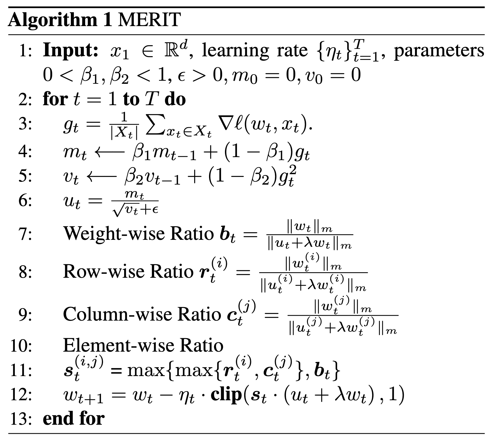
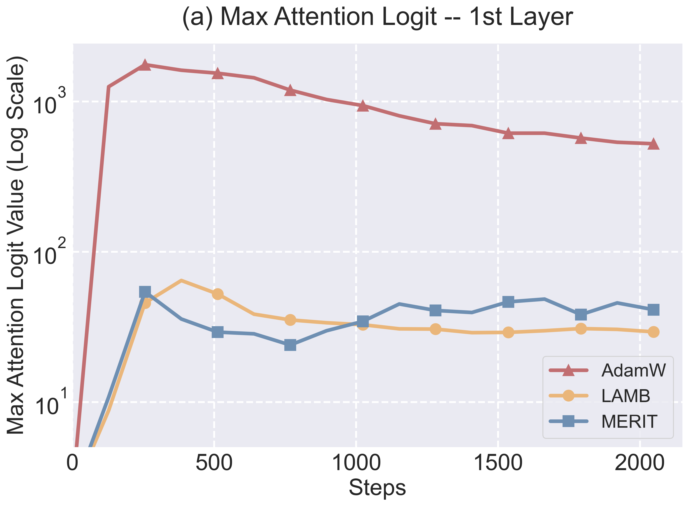
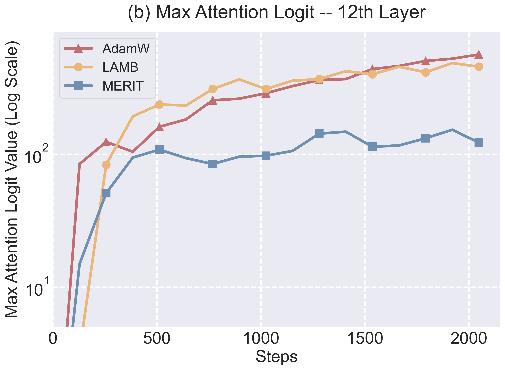

<h2 align="center">MERIT Optimizer</h2>
<h3 align="center">ICML 2025 | [Paper](https://openreview.net/forum?id=NSxKNNFni0)</h3> 

This is an official implementation of **MERIT** optimizer in the "MERIT: Maximum-normalized Element-wise Ratio for Language Model Large-batch Training". Please cite the paper and star this repo if you find MERIT useful. Thanks!

## Method

MERIT is a novel optimizer that leverages the max-norm to calculate the trust ratio, effectively constraining the maximum attention logit. Furthermore, MERIT constructs element-wise trust ratios to enable more robust update scaling by focusing on local weight structures.

<p align="center">

</p>

## Visualization
Compared to LAMB and AdamW, MERIT better controls the maximum attention logit.

<p align="center">
  
  
</p>

## Usage

```python
from optim.merit import MERIT
optimizer = MERIT(
    model.parameters(),
    lr=2e-4,
    weight_decay=1e-2,
    betas=(0.9, 0.95),
)
```

## Citation

```bibtex
@inproceedings{luo2025merit,
title={{MERIT}: Maximum-normalized Element-wise Ratio for Language Model Large-batch Training},
author={Yang Luo and Zangwei Zheng and Ziheng Qin and Zirui Zhu and Yong Liu and Yang You},
booktitle={Forty-second International Conference on Machine Learning},
year={2025},
url={https://openreview.net/forum?id=NSxKNNFni0}
}
```